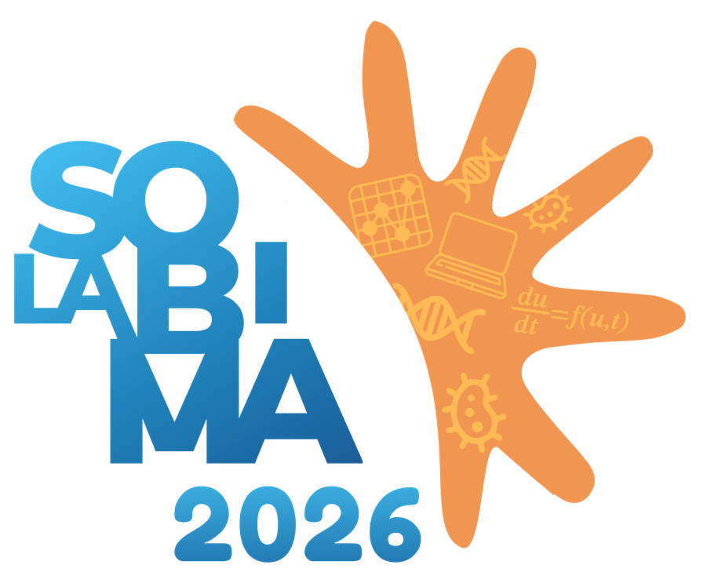

  

# SOLABIMA 2026 Poster Template

En este repositorio encontrarás los templates para la elaboración de los posters a ser presentados en el XIV Congreso de la Sociedad Latinoamericana de Biología Matemática (SOLABIMA 2026), 5–9 de octubre de 2026, Facultad Politécnica - UNA, Paraguay.

## Templates disponibles

### LaTeX

La carpeta `latex` contiene los archivos necesarios para generar el poster usando LaTeX (clase `tikzposter`). La recomendación es utilizar [Overleaf](https://www.overleaf.com/) subiendo la carpeta completa, con las siguientes configuraciones:

* Compiler: pdfLaTeX
* Main document: solabima2026_poster.tex

Nota: también debería ser posible compilar el proyecto en forma local con cualquier distribución TeX Live/MacTeX reciente. Sin embargo, **no** brindaremos soporte técnico en el uso de LaTeX.

### PowerPoint

Simplemente ingresa a la carpeta `pptx`, descarga el archivo `solabima2026_poster_template.pptx`, abre PowerPoint y edita el template.

## Indicaciones

* El tamaño de página es A0. Es responsabilidad de los presentadores traer sus posters **impresos**.
* El poster puede redactarse en español, inglés o portugués.
* Las secciones incluidas en los templates son solo una guía orientativa; siéntase libre de adaptarlas según su trabajo.
* No modifique la posición ni el tamaño del bloque de título (encabezado) ni la de los dos logos que lo flanquean.
* La franja de logos al pie es opcional y de uso libre: puede agregar ahí los logos de auspiciantes o entidades financiadoras, información adicional, un código QR, o eliminarla por completo si no la necesita.

## Problemas

Si encuentras algún problema o tienes una sugerencia, por favor crea un [issue](https://github.com/nidtec-una/solabima_2026_poster_template/issues) en este repositorio.
